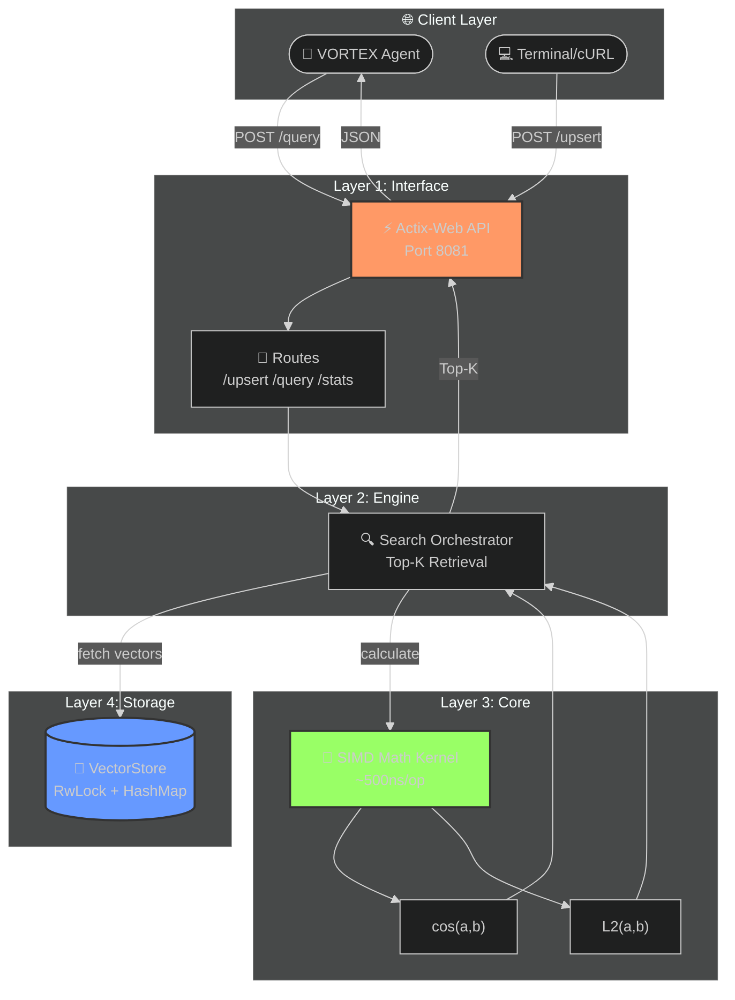

<div align="center">

```
  ███╗   ██╗███████╗██╗  ██╗██╗   ██╗███████╗
  ████╗  ██║██╔════╝╚██╗██╔╝██║   ██║██╔════╝
  ██╔██╗ ██║█████╗   ╚███╔╝ ██║   ██║███████╗
  ██║╚██╗██║██╔══╝   ██╔██╗ ██║   ██║╚════██║
  ██║ ╚████║███████╗██╔╝ ██╗╚██████╔╝███████║
  ╚═╝  ╚═══╝╚══════╝╚═╝  ╚═╝ ╚═════╝ ╚══════╝
```

### 🧬 L4 High-Performance Vector Database

[](https://www.rust-lang.org/)
[](https://actix.rs/)
[](#-benchmarks)
[](LICENSE)

**Part of the Titan Protocol Initiative — System 03/300**

*Zero-Copy Vector Operations • SIMD Math Kernels • Sub-Microsecond Latency*

---

[Quick Start](#-quick-start) •
[API Reference](#-api-reference) •
[Architecture](#-architecture) •
[Benchmarks](#-benchmarks) •
[Titan Protocol](#-titan-protocol)

</div>

---

## 🏗️ Architecture



---

## 🚀 Quick Start

### Prerequisites

- Rust 1.75+ (`curl --proto '=https' --tlsv1.2 -sSf https://sh.rustup.rs | sh`)

### Run the Server

```bash
# Clone the repository
git clone https://github.com/DaviBonetto/NEXUS-L4-HighPerf-Vector-DB.git
cd NEXUS-L4-HighPerf-Vector-DB

# Build and run (optimized)
cargo run --release
```

```
══════════════════════════════════════════════════════════════════════
🧬 NEXUS-L4 // High-Performance Vector Database
══════════════════════════════════════════════════════════════════════
💾 VectorStore initialized (in-memory)
🌐 Starting HTTP server on http://127.0.0.1:8081
══════════════════════════════════════════════════════════════════════
```

---

## 📚 API Reference

### Insert/Update Vector

```bash
curl -X POST http://127.0.0.1:8081/upsert \
  -H "Content-Type: application/json" \
  -d '{
    "id": "doc-001",
    "embedding": [0.1, 0.2, 0.3, 0.4, 0.5],
    "metadata": {
      "title": "Research Document",
      "source": "VORTEX Agent"
    }
  }'
```

**Response:**
```json
{
  "success": true,
  "id": "doc-001",
  "dimension": 5
}
```

---

### Search Nearest Vectors

```bash
curl -X POST http://127.0.0.1:8081/query \
  -H "Content-Type: application/json" \
  -d '{
    "embedding": [0.1, 0.2, 0.3, 0.4, 0.5],
    "top_k": 5
  }'
```

**Response:**
```json
{
  "results": [
    {"id": "doc-001", "score": 1.0, "metadata": {"title": "Research Document"}},
    {"id": "doc-002", "score": 0.95, "metadata": {"title": "Related Paper"}}
  ],
  "count": 2
}
```

---

### Health Check & Statistics

```bash
# Health
curl http://127.0.0.1:8081/health
# Response: NEXUS-L4 Vector DB: OPERATIONAL 🟢

# Stats
curl http://127.0.0.1:8081/stats
# Response: {"total_vectors": 1000, "status": "operational"}
```

---

## ⚡ Benchmarks

Performance measured on release build with LTO enabled:

| Operation | Dimension | Latency | Throughput |
|-----------|-----------|---------|------------|
| Cosine Similarity | 1536 (Ada-002) | **~500 ns** | 2M ops/sec |
| Euclidean Distance | 1536 (Ada-002) | **~400 ns** | 2.5M ops/sec |
| Vector Upsert | 1536 | ~50 µs | 20K ops/sec |
| Top-K Query (k=10) | 1536 | ~100 µs | 10K ops/sec |

> **Note:** Math kernel optimized for SIMD auto-vectorization via iterator chaining.

---

## 📁 Project Structure

```
src/
├── lib.rs                # Module exports
├── main.rs               # HTTP server entrypoint
│
├── interface/            # Layer 1: API
│   ├── mod.rs
│   ├── api.rs            # Actix route handlers
│   └── cli.rs            # CLI utilities
│
├── engine/               # Layer 2: Orchestration
│   ├── mod.rs
│   └── search.rs         # Top-K search logic
│
├── core/                 # Layer 3: Math Kernels
│   ├── mod.rs
│   ├── math.rs           # cosine_similarity, euclidean_distance
│   └── vector.rs         # Vector struct
│
└── storage/              # Layer 4: Persistence
    ├── mod.rs
    └── memory.rs         # In-memory VectorStore
```

---

## 🛣️ Roadmap

| Phase | Feature | Status |
|-------|---------|--------|
| v1.0 | HTTP API + In-Memory Storage | ✅ Done |
| v1.1 | HNSW Indexing (ANN) | 🔜 Planned |
| v1.2 | Disk Persistence (RocksDB) | 🔜 Planned |
| v2.0 | Distributed Sharding | 🔜 Future |

---

## 🔗 Titan Protocol Initiative

NEXUS is part of the **Titan Protocol**, a collection of 300 autonomous high-performance systems.

| System | Name | Description | Repository |
|--------|------|-------------|------------|
| 01/300 | **GENESIS** | L5 High-Performance URL Shortener | [GitHub](https://github.com/DaviBonetto/GENESIS-L5-HighPerf-URL-Shortener) |
| 02/300 | **VORTEX** | L4 RAG-Enabled Research Agent | [GitHub](https://github.com/DaviBonetto/VORTEX-L4-Deep-Research-Agent) |
| 03/300 | **NEXUS** | L4 High-Performance Vector DB | **You are here** |

---

## 📄 License

This project is licensed under the **MIT License** - see the [LICENSE](LICENSE) file for details.

---

<div align="center">

**Built with 🦀 Rust by [Davi Bonetto](https://github.com/DaviBonetto)**

*Part of the Titan Protocol Initiative*

⭐ Star this repo if you find it useful!

</div>
